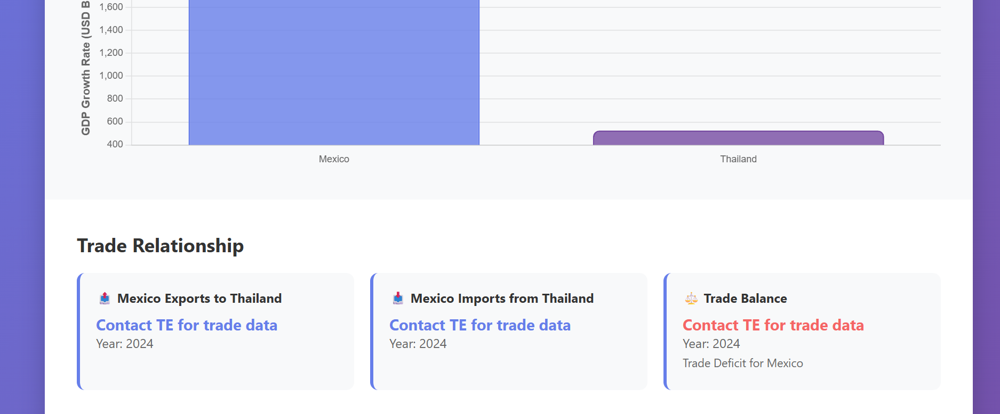

# Trading Economics Country Comparison Dashboard

## Images





## 🌍 Overview

This web application provides a comprehensive comparison tool for economic indicators between different countries using the Trading Economics API. It's designed as part of the Trading Economics Developer Challenge and demonstrates real-time economic data visualization and analysis.

## ✨ Features

- **Country Comparison**: Compare economic indicators between any two countries
- **Multiple Indicators**: Support for GDP growth, inflation, unemployment, interest rates, population, and government debt
- **Interactive Charts**: Beautiful, animated charts using Chart.js
- **Trade Relationship Analysis**: Shows import/export data and trade balance between countries
- **Responsive Design**: Works seamlessly on desktop and mobile devices
- **Real-time Data**: Fetches the latest economic data from Trading Economics API

## 🚀 Live Demo

Simply open `index.html` in your web browser to start using the application.

## 🛠️ Technologies Used

- **HTML5**: Structure and semantic markup
- **CSS3**: Modern styling with gradients, animations, and responsive design
- **JavaScript (ES6+)**: Interactive functionality and API integration
- **Chart.js**: Data visualization library for creating beautiful charts
- **Trading Economics API**: Economic data source

## 📊 Supported Economic Indicators

1. **GDP Growth Rate** - Quarterly economic growth percentage
2. **Inflation Rate** - Monthly inflation data
3. **Unemployment Rate** - Labor market statistics
4. **Interest Rate** - Central bank policy rates
5. **Population** - Total population figures
6. **Government Debt to GDP** - Public debt as percentage of GDP

## 🌐 Supported Countries

The application includes data for major economies:
- Mexico
- New Zealand
- Thailand
- Sweden

## � API Integration

### Live Data Access
This application  integrates with  **Trading Economics Developer API key** and provides real-time data for:

**🌍 Available Countries (Free Developer Account):**
- **Mexico** 🇲🇽 - Full economic indicators and market data
- **New Zealand** 🇳🇿 - Full economic indicators and market data  
- **Sweden** 🇸🇪 - Full economic indicators and market data
- **Thailand** 🇹🇭 - Full economic indicators and market data

**📊 Available Data:**
- Economic indicators (GDP, inflation, unemployment, etc.)
- Live market indices 
- Real-time financial data
- Search functionality

### API Configuration
The application is pre-configured with the free developer API key

### Testing Your API Access
Open `api-test.html` to test and verify  API connectivity and see live data examples.

## 💻 Usage

### Main Dashboard (`index.html`)
1. **Select Countries**: Choose from Mexico, New Zealand, Sweden, Thailand (live API data) 
2. **Choose Indicator**: Select the economic indicator you want to compare
3. **Compare**: Click the "Compare Countries" button
4. **Analyze Results**: View comparison in statistics cards, interactive chart, trade relationships, and live market data

### API Testing (`api-test.html`)
1. **Test Connectivity**: Verify your API key is working
2. **Live Market Data**: See real-time market indices
3. **Economic Indicators**: Fetch actual economic data
4. **Search Functionality**: Test the search API

### Search Demo (`search-demo.html`)
1. **Interactive Search**: Use the Trading Economics search API
2. **Query Examples**: Try pre-built search terms
3. **Data Discovery**: Explore available datasets

## 🎨 Design Features

- **Modern UI**: Clean, professional interface with gradient backgrounds
- **Responsive Layout**: Adapts to different screen sizes
- **Smooth Animations**: Engaging user experience with CSS transitions
- **Data Visualization**: Interactive charts with hover effects
- **Loading States**: User-friendly loading indicators
- **Error Handling**: Graceful error messages for better UX

## 📱 Mobile Responsiveness

The application is fully responsive and provides an excellent experience on:
- Desktop computers
- Tablets
- Mobile phones

## 🔍 Code Structure

```
web-app/
├── index.html      # Main HTML structure
├── styles.css      # CSS styling and responsive design
├── app.js          # JavaScript functionality and API integration
└── README.md       # This documentation file
```

### Key Classes

- **TradingEconomicsAPI**: Handles API calls and data management
- **Dashboard**: Main application controller managing UI interactions

## 🌟 Key Features Explained

### Real-time Data Comparison
The application fetches and compares the latest economic indicators, providing users with up-to-date information for informed decision-making.

### Interactive Visualizations
Charts are dynamically generated based on user selections, with smooth animations and hover effects for better data exploration.

### Trade Relationship Analysis
Beyond basic economic indicators, the app shows trade relationships between countries, including:
- Export values
- Import values
- Trade balance calculations
- Visual indicators for trade surplus/deficit

## 🚀 Future Enhancements

Potential improvements for the application:
- Historical data trends and time-series charts
- More economic indicators (forex rates, stock indices)
- Country rankings and global comparisons
- Export functionality for charts and data
- Advanced filtering and search capabilities
- Real-time data streaming for live updates

## 📈 Trading Economics API Integration

This application demonstrates integration with several Trading Economics endpoints:
- Indicators API for economic data

- Search API for data discovery

## 🤝 Contributing

This project was created as part of the Trading Economics Developer Challenge. Contributions and improvements are welcome!

## 📄 License

This project is open source and available under the MIT License.

## 🙏 Acknowledgments

- **Trading Economics** for providing comprehensive economic data
- **Chart.js** for the excellent charting library
- **MDN Web Docs** for web development references

## 📞 Contact

For questions about this implementation or the Trading Economics API, please refer to:
- [Trading Economics Documentation](https://docs.tradingeconomics.com)
- [Trading Economics GitHub](https://github.com/tradingeconomics/tradingeconomics)

---

*Built with ❤️ as part of the Ngenoh for the Trading Economics Developer Challenge*